# Лабораторная работа 2
# Студент: Gachayev Dmitrii, I2302
# Дата выполнения: 11.10.2025
# Цель работы
Познакомиться с основными вычислительными сервисами AWS, научиться создавать и настраивать виртуальные машины (EC2), а также развёртывать простые веб-приложения.
# Задача

---

## Задание 0. Подготовка среды 

Регистрируюсь на `AWS`, создаю `Free Tier` аккаунт, вхожу в консоль и меняю сервер на `Frankfurt` 

## Задание 1. Создание IAM группы и пользователя

Открываю сервис IAM, создаю новую группу с именем `Admins` и в качестве `Policy` выбираю `Administrator Acces`:

> Что делает данная политика?

> Это стандартная политика типа “AWS managed – job function”, которую поддерживает и обновляет AWS. Она даёт максимально широкие права: по сути разрешение на все действия со всеми ресурсами в аккаунте. Если прикрепить эту политику к создаваемой user group, то каждый пользователь, добавленный в эту группу, получит полный административный доступ ко всем сервисам и сможет создавать, изменять и удалять любые ресурсы, а также управлять IAM-сущностями.

Далее перехожу в раздел `Users` и нажимаю `Add User`, ввожу имя пользователя и привязываю его к группе `Admins`, а также разрешаю доступ к `AWS Managment Console`

Выхожу из root-пользователя и вхожу под новым юзером, используя данные из документа. Проверяю, что есть доступ к консоли

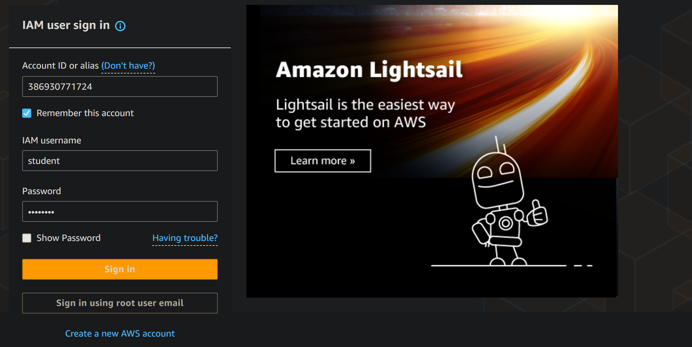

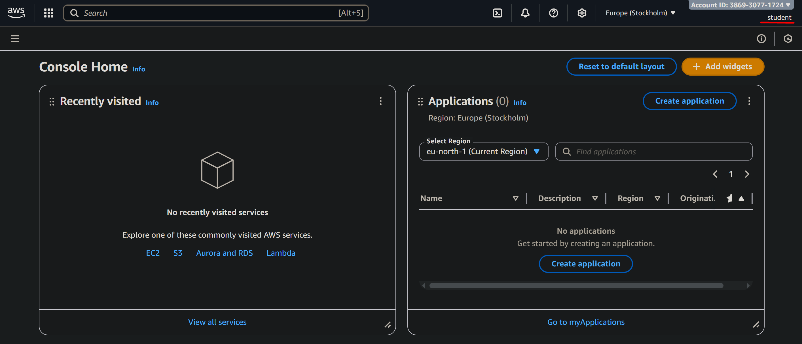

## Задание 2. Настройка Zero-Spend Budget

Перехожу в `Billing and Cost Management` -> `Budgets` -> `Create budget`, выбираю шаблон `Zero Spend Budget` и создаю бюджет.

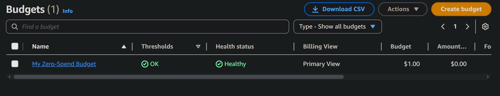

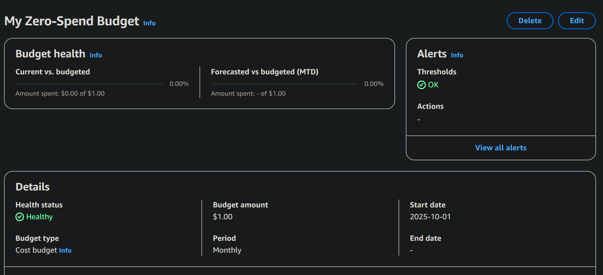

## Задание 3. Создание и запуск EC2 экземпляра

Открываю сервис `EC2` создаю `Instance` и заполняю указанные параметры для запуска виртуальной машины:

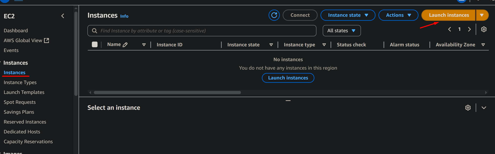

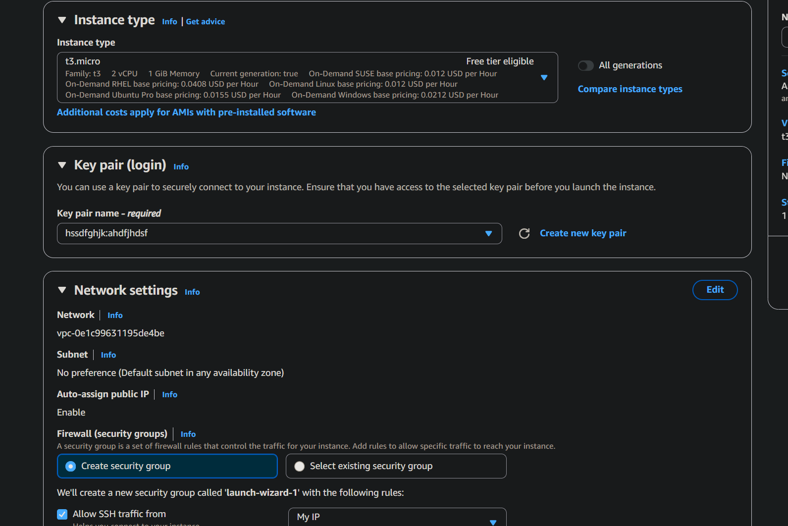

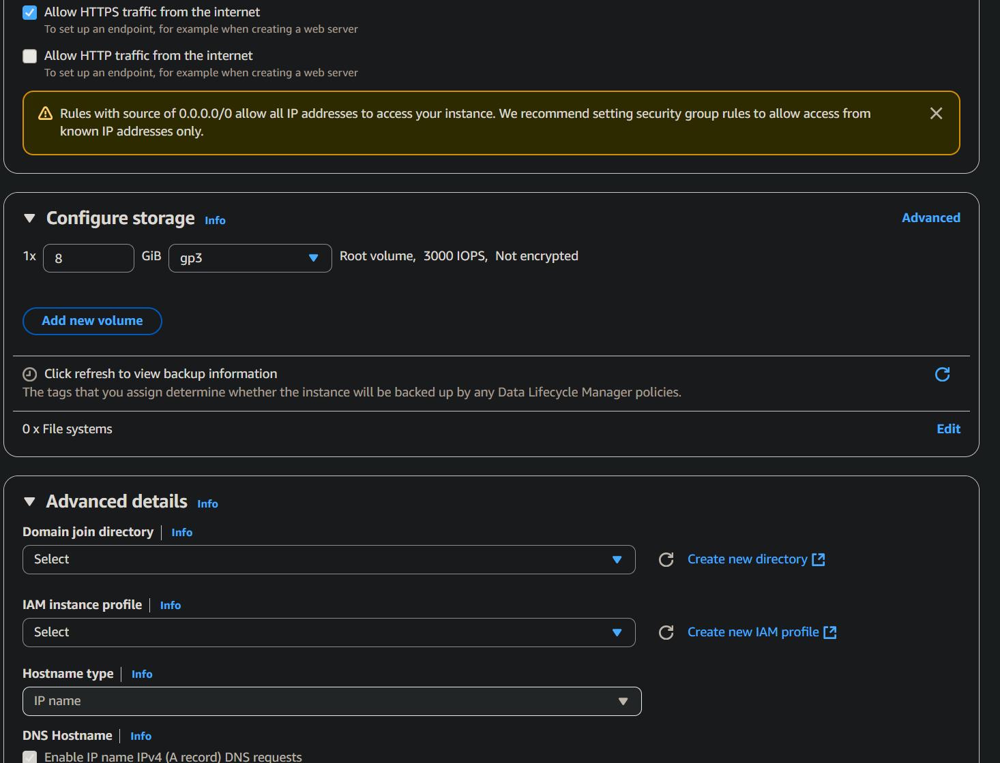

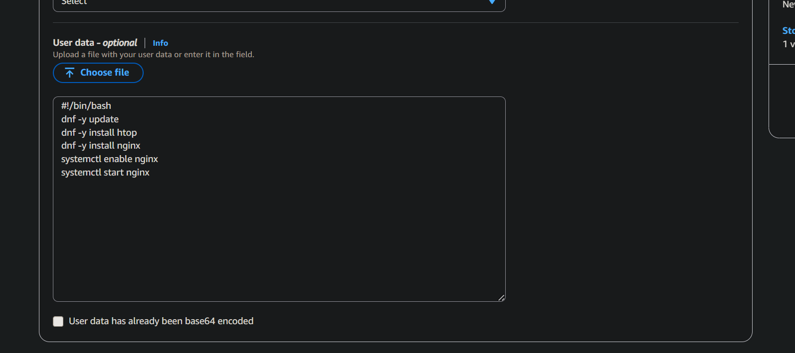

> Что такое User Data и какую роль выполняет данный скрипт? Для чего используется nginx?

> User Data — это поле, куда передаются инструкции первичной инициализации машины. Эти данные обрабатывает сервис cloud-init при первом запуске инстанса. Так можно сразу "поднять" нужное окружение: установить пакеты, создать файлы, включить сервисы.

> Nginx используется как веб-сервер, чтобы инстанс сразу после запуска отдавал страницу по HTTP. Это удобно для быстрой проверки, что машина жива, порт 80 открыт и User Data сработал.

Жму `Launch Instance` и запускаю виртуальную машину

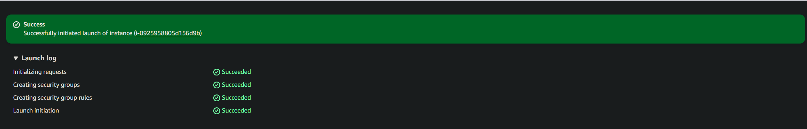

Проверяю доступ по публичному IP:

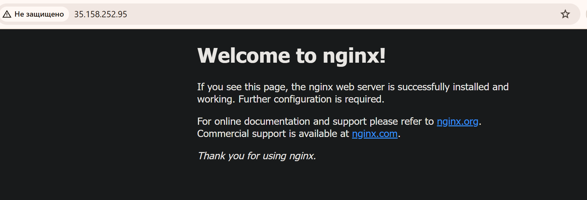

## Задание 4. Логирование и мониторинг

Проверяю, что все проверки инстанса прошли успешно:

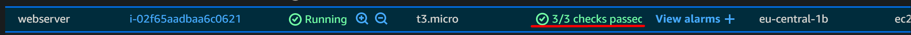

Открываю вкладку с метриками, нажимаю на одной из них `Enlarge`:

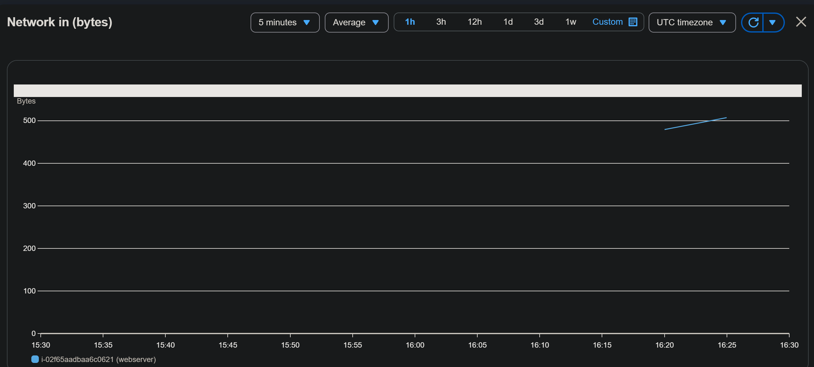

> В каких случаях важно включать детализированный мониторинг?

> Детализированный мониторинг имеет смысл включать там, где важна быстрая реакция и видимость кратковременных пиков. Это прежде всего автоскейлинг по метрикам (чем чаще приходят данные, тем точнее и быстрее масштабирование), высоконагруженные веб-сервисы с резкими всплесками трафика, нагрузочное тестирование и тонкая настройка размеров инстансов.

Нажимаю `Actions` → `Monitor and troubleshoot` → `Get system log` и нахожу строки об установке пакетов.

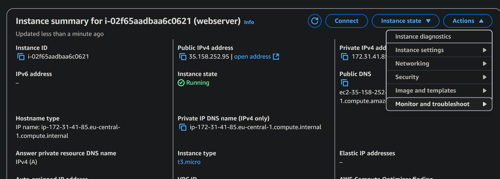

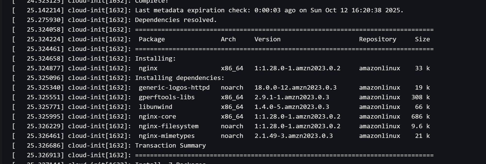

Нажимаю `Actions` → `Monitor and troubleshoot` → `Get instance screenshot` и получаю скриншот инстанса.

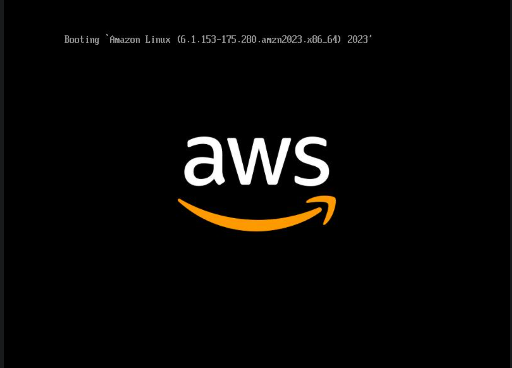

## Задание 5. Подключение к EC2 инстансу по SSH

Подключаюсь к инстансу по SSH, выполняю команду `systemctl status nginx` и вижу следующее:

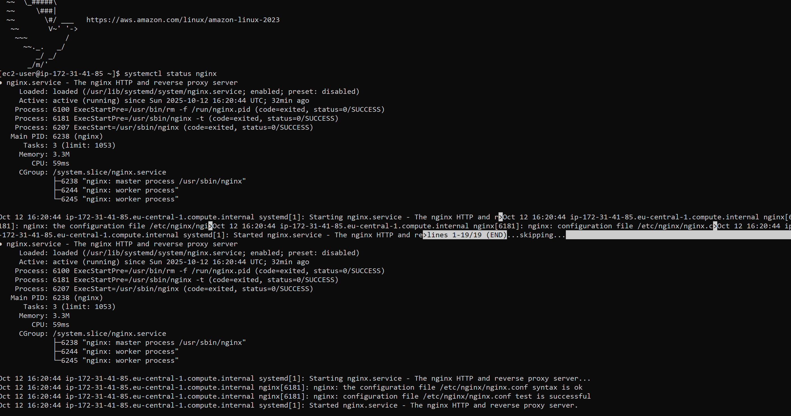

> Почему в AWS нельзя использовать пароль для входа по SSH?

> В AWS вход по паролю в EC2 по умолчанию отключён, потому что пароли легко подобрать или украсть, ими неудобно управлять и их часто повторно используют. Вместо этого входят по ключ-паре: публичный ключ кладётся на сервер при запуске, а приватный остаётся только у root пользователя - без него зайти нельзя. Это и безопаснее, и проще.

## Задание 6a. Развёртывание статического веб-сайта

Решил выбрать данное задание, так как больше увлекаюсь веб-разработкой.

