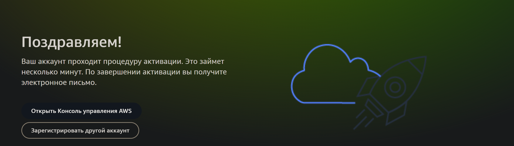
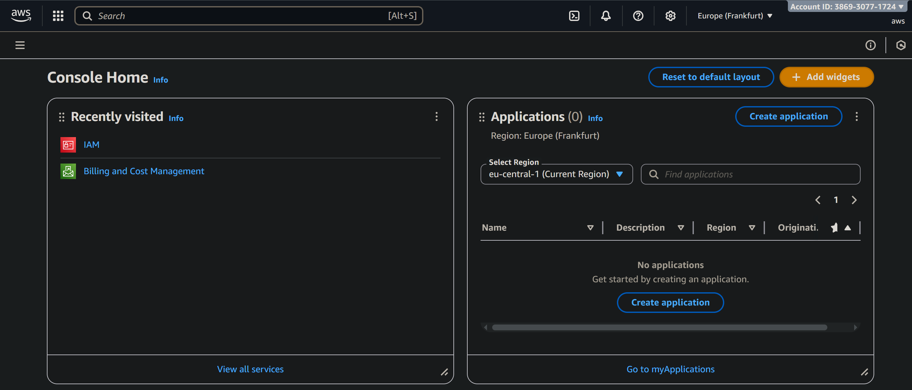
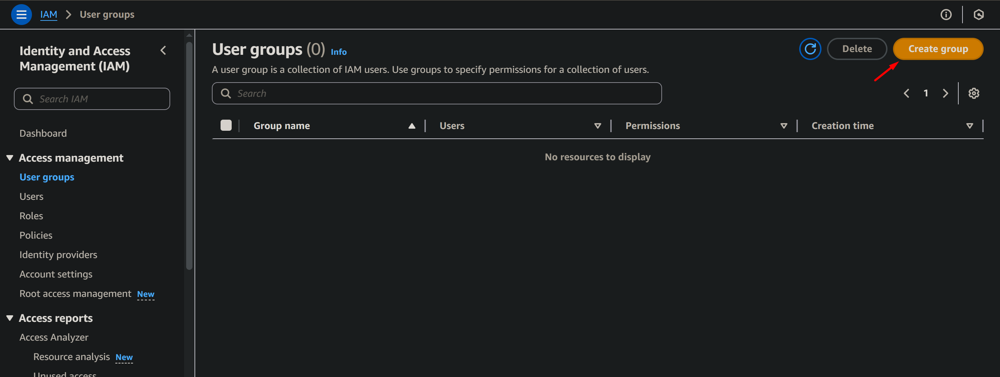
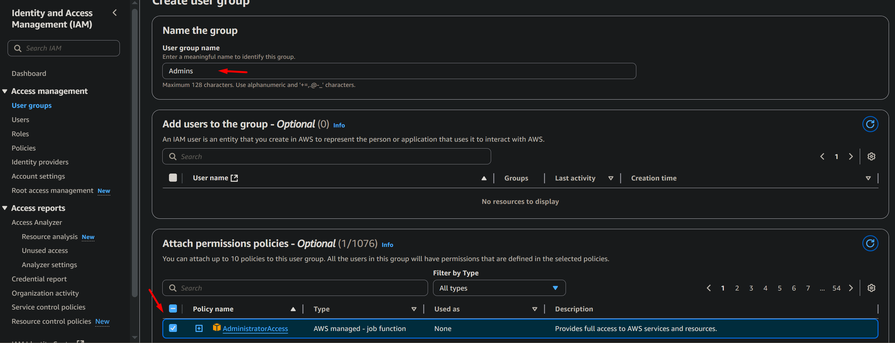
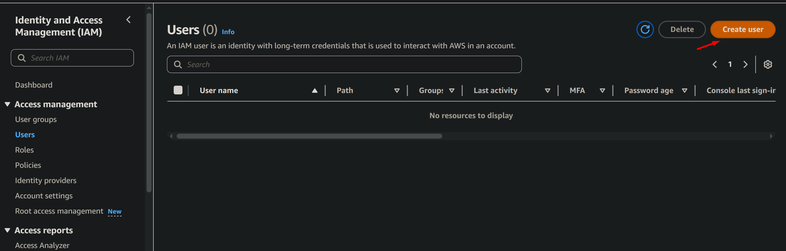
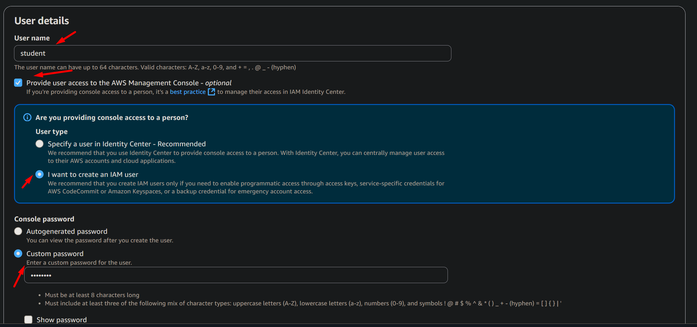
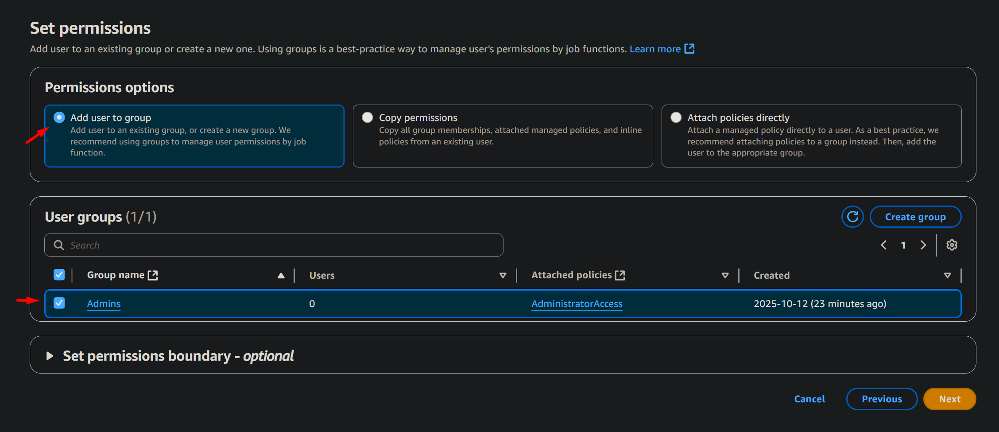

# Лабораторная работа 2
# Студент: Gachayev Dmitrii, I2302
# Дата выполнения: 11.10.2025
# Цель работы
Познакомиться с основными вычислительными сервисами AWS, научиться создавать и настраивать виртуальные машины (EC2), а также развёртывать простые веб-приложения.
# Задача

---

## Задание 0. Подготовка среды 

Регистрируюсь на `AWS`, создаю `Free Tier` аккаунт, вхожу в консоль и меняю сервер на `Frankfurt` 

## Задание 1. Создание IAM группы и пользователя

Открываю сервис IAM, создаю новую группу с именем `Admins` и в качестве `Policy` выбираю `Administrator Acces`:

> Что делает данная политика?

> Это стандартная политика типа “AWS managed – job function”, которую поддерживает и обновляет AWS. Она даёт максимально широкие права: по сути разрешение на все действия со всеми ресурсами в аккаунте. Если прикрепить эту политику к создаваемой user group, то каждый пользователь, добавленный в эту группу, получит полный административный доступ ко всем сервисам и сможет создавать, изменять и удалять любые ресурсы, а также управлять IAM-сущностями.

Далее перехожу в раздел `Users` и нажимаю `Add User`, ввожу имя пользователя и привязываю его к группе `Admins`, а также разрешаю доступ к `AWS Managment Console`

