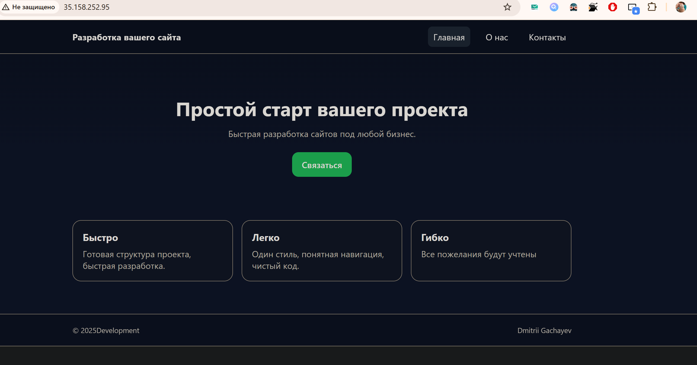

# Лабораторная работа 2
# Студент: Gachayev Dmitrii, I2302
# Дата выполнения: 11.10.2025
# Цель работы
Познакомиться с основными вычислительными сервисами AWS, научиться создавать и настраивать виртуальные машины (EC2), а также развёртывать простые веб-приложения.
# Задача
В рамках лабораторной работы необходимо получить практические навыки работы с облачными вычислительными ресурсами AWS, освоить процесс развертывания и базовой конфигурации виртуальной инфраструктуры.
---


## Задание 0. Подготовка среды 

Регистрируюсь на `AWS`, создаю `Free Tier` аккаунт, вхожу в консоль и меняю сервер на `Frankfurt` 


## Задание 1. Создание IAM группы и пользователя

Открываю сервис IAM, создаю новую группу с именем `Admins` и в качестве `Policy` выбираю `Administrator Acces`:


> Что делает данная политика?

> Это стандартная политика типа “AWS managed – job function”, которую поддерживает и обновляет AWS. Она даёт максимально широкие права: по сути разрешение на все действия со всеми ресурсами в аккаунте. Если прикрепить эту политику к создаваемой user group, то каждый пользователь, добавленный в эту группу, получит полный административный доступ ко всем сервисам и сможет создавать, изменять и удалять любые ресурсы, а также управлять IAM-сущностями.

Далее перехожу в раздел `Users` и нажимаю `Add User`, ввожу имя пользователя и привязываю его к группе `Admins`, а также разрешаю доступ к `AWS Managment Console`


Выхожу из root-пользователя и вхожу под новым юзером, используя данные из документа. Проверяю, что есть доступ к консоли


## Задание 2. Настройка Zero-Spend Budget

Перехожу в `Billing and Cost Management` -> `Budgets` -> `Create budget`, выбираю шаблон `Zero Spend Budget` и создаю бюджет.


## Задание 3. Создание и запуск EC2 экземпляра

Открываю сервис `EC2` создаю `Instance` и заполняю указанные параметры для запуска виртуальной машины:


> Что такое User Data и какую роль выполняет данный скрипт? Для чего используется nginx?

> User Data — это поле, куда передаются инструкции первичной инициализации машины. Эти данные обрабатывает сервис cloud-init при первом запуске инстанса. Так можно сразу "поднять" нужное окружение: установить пакеты, создать файлы, включить сервисы.

> Nginx используется как веб-сервер, чтобы инстанс сразу после запуска отдавал страницу по HTTP. Это удобно для быстрой проверки, что машина жива, порт 80 открыт и User Data сработал.

Жму `Launch Instance` и запускаю виртуальную машину


Проверяю доступ по публичному IP:


## Задание 4. Логирование и мониторинг

Проверяю, что все проверки инстанса прошли успешно:


Открываю вкладку с метриками, нажимаю на одной из них `Enlarge`:


> В каких случаях важно включать детализированный мониторинг?

> Детализированный мониторинг имеет смысл включать там, где важна быстрая реакция и видимость кратковременных пиков. Это прежде всего автоскейлинг по метрикам (чем чаще приходят данные, тем точнее и быстрее масштабирование), высоконагруженные веб-сервисы с резкими всплесками трафика, нагрузочное тестирование и тонкая настройка размеров инстансов.

Нажимаю `Actions` → `Monitor and troubleshoot` → `Get system log` и нахожу строки об установке пакетов.


Нажимаю `Actions` → `Monitor and troubleshoot` → `Get instance screenshot` и получаю скриншот инстанса.


## Задание 5. Подключение к EC2 инстансу по SSH

Подключаюсь к инстансу по SSH, выполняю команду `systemctl status nginx` и вижу следующее:


> Почему в AWS нельзя использовать пароль для входа по SSH?

> В AWS вход по паролю в EC2 по умолчанию отключён, потому что пароли легко подобрать или украсть, ими неудобно управлять и их часто повторно используют. Вместо этого входят по ключ-паре: публичный ключ кладётся на сервер при запуске, а приватный остаётся только у root пользователя - без него зайти нельзя. Это и безопаснее, и проще.

## Задание 6a. Развёртывание статического веб-сайта

Решил выбрать данное задание, так как больше увлекаюсь веб-разработкой.

Переношу файлы с локальной машины на инстанс через `SSH`, сначала в домашнюю директорию, а после с директорию `nginx`:
```bash
Lab02\website>scp -i key.pem index.html ec2-user@35.158.252.95:~
index.html                                                                            100% 3924    73.8KB/s   00:00

Lab02\website>scp -i key.pem about.html ec2-user@35.158.252.95:~
about.html                                                                            100% 3742    74.5KB/s   00:00

Lab02\website>scp -i key.pem contact.html ec2-user@35.158.252.95:~
contact.html
```

Далее подключаюсь к EC2 и переношу файлы в нужную  папку:
```bash
sudo mv ~/index.html ~/about.html ~/contact.html /usr/share/nginx/html/
systemctl reload nginx
sudo systemctl reload nginx

ls -l /usr/share/nginx/html
total 28
-rw-r--r--. 1 root     root     3650 Aug 12 21:18 404.html
-rw-r--r--. 1 root     root     3693 Aug 12 21:18 50x.html
-rw-rw-r--. 1 ec2-user ec2-user 3742 Oct 12 17:25 about.html
-rw-rw-r--. 1 ec2-user ec2-user 4839 Oct 12 17:25 contact.html
drwxr-xr-x. 2 root     root       27 Oct 12 16:20 icons
-rw-rw-r--. 1 ec2-user ec2-user 3924 Oct 12 17:24 index.html
-rw-r--r--. 1 root     root      368 Aug 12 21:18 nginx-logo.png
lrwxrwxrwx. 1 root     root       14 Aug 12 21:19 poweredby.png -> nginx-logo.png
[ec2-user@ip-172-31-41-85 html]$
```

Открываю в браузере публичный ip и проверяю что сайт работает:



## Задание 7. Завершение работы и удаление ресурсов
Останавливаю запущенную виртуальную машину.

> - `Stop` просто выключает виртуальную машину, сохраняя все данные на диске - её можно потом снова запустить.
> - `Terminate` полностью удаляет инстанс и его диск, после чего восстановить его уже нельзя.

## Источники
1. Документация AWS [https://docs.aws.amazon.com/]
2. Курс Cloud Computing [https://github.com/MSU-Courses/cloud-computing/tree/main]

## Вывод
В результате выполнения лабораторной работы удалось освоить основные принципы работы с вычислительными сервисами AWS, научиться создавать и настраивать виртуальные машины EC2, а также размещать на них простые веб-приложения.
