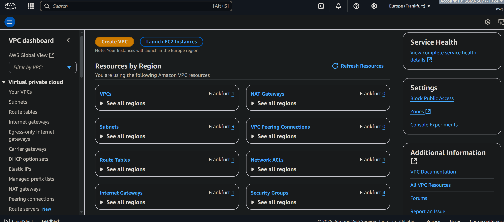
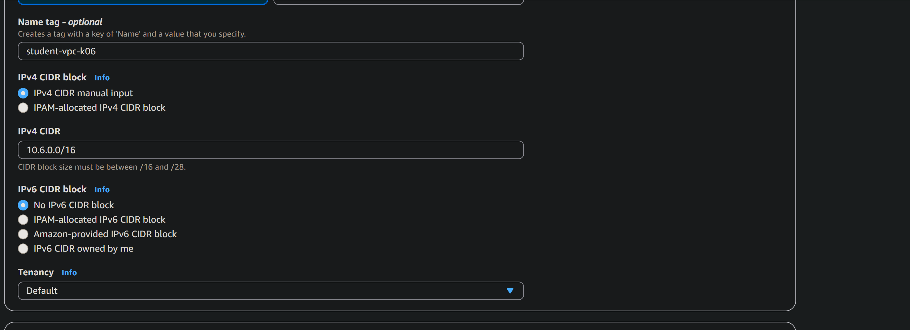
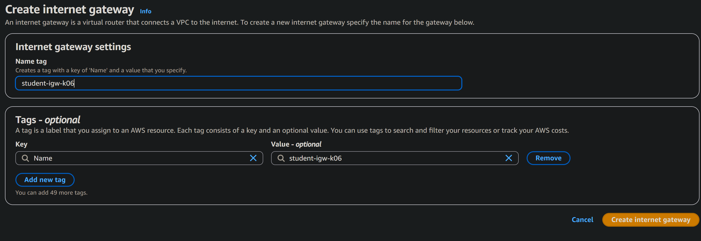
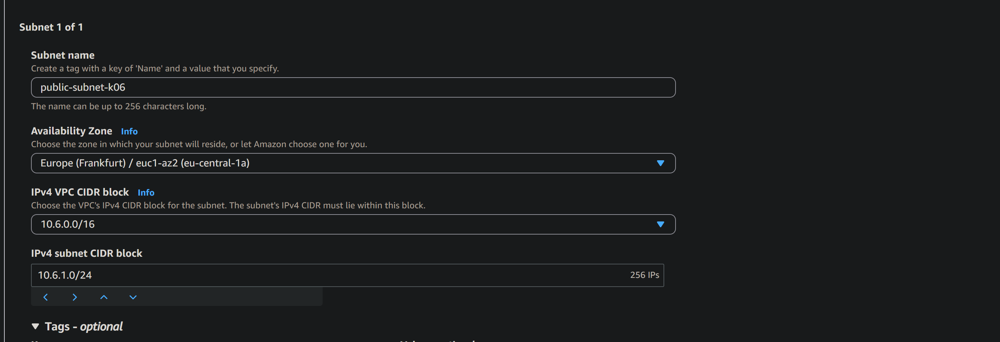
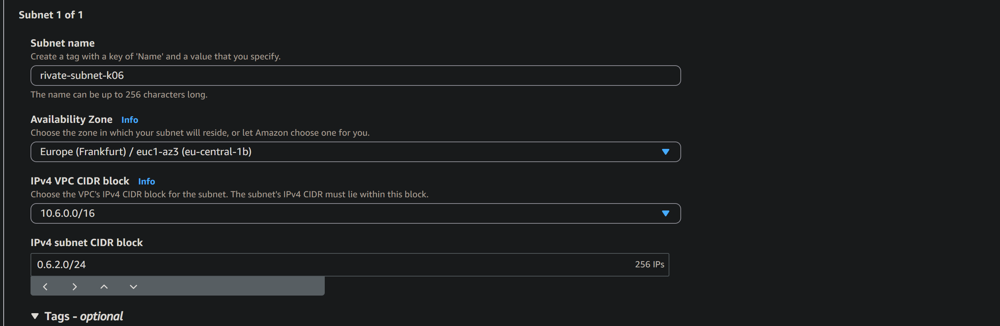
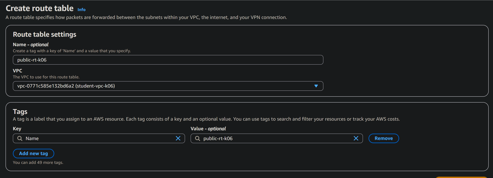
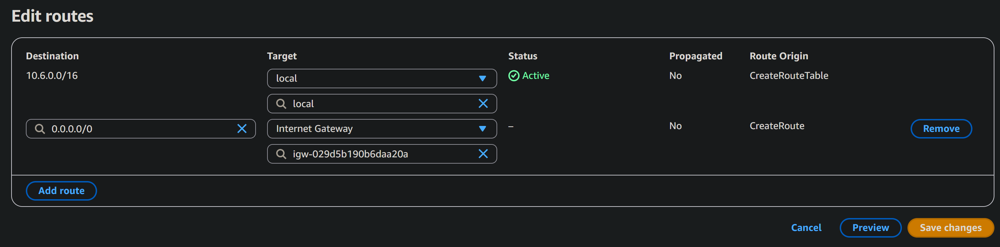
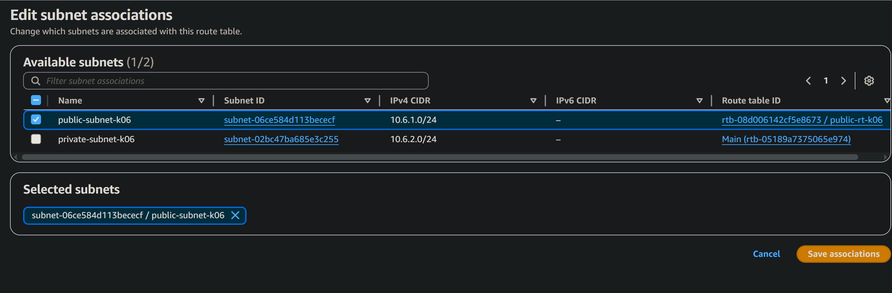

# Лабораторная работа 3
# Студент: Gachayev Dmitrii, I2302
# Дата выполнения: 23.10.2025
# Цель работы

# Задача

---

## Шаг 1. Подготовка среды
Вхожу в `AWS` консоль, убеждаюсь, что регион установлен на `Frankfurt`, вхожу в `VPC Console`

## Шаг 2. Создание VPC

Создаю `VPC` со следующими параметрами:

> Что обозначает маска /16? И почему нельзя использовать, например, /8?

> Маска `/16` указывает, сколько бит из 32-битного IP-адреса относятся к сети, а остальные - к хостам.
`/16` - 16 бит = часть сети, остальные 16 бит = часть хоста

> Маска `/8` оставляет 24 бита для хостов, т.е. более 16 миллионов адресов в одной сети. Это слишком много, cеть становится неуправляемой

## Шаг 3. Создание Internet Gateway (IGW)
Создаю IGW:

Далее выбираю `Actions` -> `Attach to VPC`

## Шаг 4.1 Создание публичной подсети
Захожоу в `Subnets` -> `Create Subnet` и выставляю следующее:

> Является ли подсеть "публичной" на данный момент? Почему?

> Сеть не является публичной так как не настроены `Route Tables`

## Шаг 4.2. Создание приватной подсети

Таким же путём создаю приватную сеть:

> Является ли подсеть "приватной" на данный момент? Почему?

> Подсеть является приватной, потому что её трафик не направляется напрямую в Internet Gateway,
следовательно, ресурсы внутри неё не имеют прямого доступа в интернет

## Шаг 5.1. Создание публичной таблицы маршрутов

Создаю public route table:

Во вкладке `Edit routes`:

Далее перехожу в `Subnet associations` -> `Edit subnet associations`

> Зачем необходимо привязать таблицу маршрутов к подсети?

> Чтобы подсеть знала, куда направлять сетевой трафик.
Привязка таблицы маршрутов определяет, есть ли у подсети доступ в интернет или только внутри VPC.