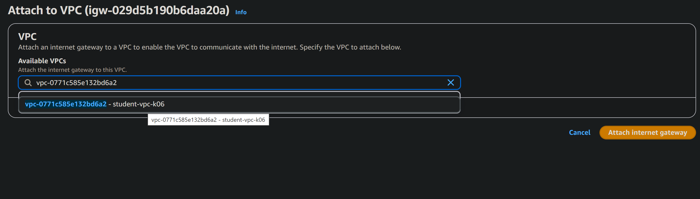
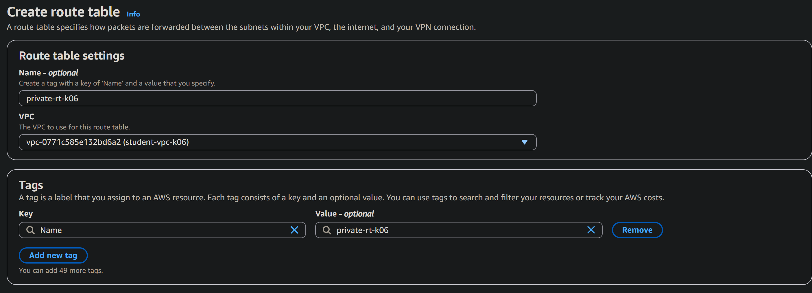
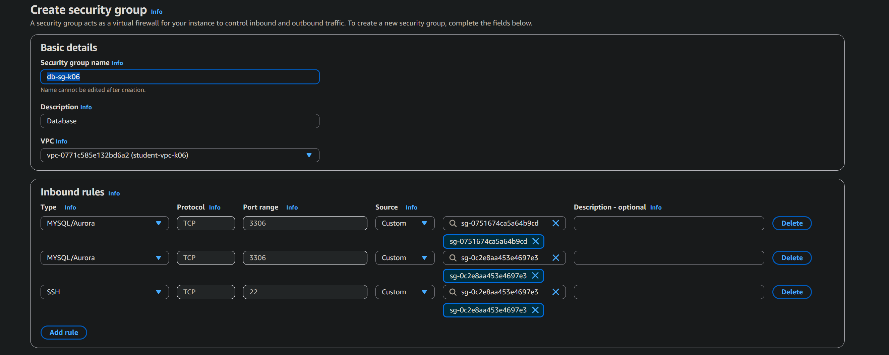

# Лабораторная работа 3
# Студент: Gachayev Dmitrii, I2302
# Дата выполнения: 23.10.2025
# Цель работы

# Задача

---

## Шаг 1. Подготовка среды
Вхожу в `AWS` консоль, убеждаюсь, что регион установлен на `Frankfurt`, вхожу в `VPC Console`

## Шаг 2. Создание VPC

Создаю `VPC` со следующими параметрами:

> Что обозначает маска /16? И почему нельзя использовать, например, /8?

> Маска `/16` указывает, сколько бит из 32-битного IP-адреса относятся к сети, а остальные - к хостам.
`/16` - 16 бит = часть сети, остальные 16 бит = часть хоста

> Маска `/8` оставляет 24 бита для хостов, т.е. более 16 миллионов адресов в одной сети. Это слишком много, cеть становится неуправляемой

## Шаг 3. Создание Internet Gateway (IGW)
Создаю IGW:

Далее выбираю `Actions` -> `Attach to VPC`

## Шаг 4.1 Создание публичной подсети
Захожоу в `Subnets` -> `Create Subnet` и выставляю следующее:

> Является ли подсеть "публичной" на данный момент? Почему?

> Сеть не является публичной так как не настроены `Route Tables`

## Шаг 4.2. Создание приватной подсети

Таким же путём создаю приватную сеть:

> Является ли подсеть "приватной" на данный момент? Почему?

> Подсеть является приватной, потому что её трафик не направляется напрямую в Internet Gateway,
следовательно, ресурсы внутри неё не имеют прямого доступа в интернет

## Шаг 5.1. Создание публичной таблицы маршрутов

Создаю public route table:

Во вкладке `Edit routes`:

Далее перехожу в `Subnet associations` -> `Edit subnet associations`

> Зачем необходимо привязать таблицу маршрутов к подсети?

> Чтобы подсеть знала, куда направлять сетевой трафик.
Привязка таблицы маршрутов определяет, есть ли у подсети доступ в интернет или только внутри VPC.

## Шаг 5.2. Создание приватной таблицы маршрутов

По той же аналогии создаю приватную таблицу:

## Шаг 6. Создание NAT Gateway

> Как работает NAT Gateway?

> NAT Gateway позволяет ресурсам из приватной подсети выходить в интернет,
но не позволяет интернету подключаться к ним обратно.

## Шаг 6.1. Создание Elastic IP

В левой панели выбираю `Elastic IPs` - `Allocate Elastic IP address`

## Шаг 6.2. Создание NAT Gateway

Перехожу в `NAT gateways` -> `Create NAT gateway`:

## Шаг 6.3. Изменение приватной таблицы маршрутов

Перехожу в `Route Tables` -> `private-rt-k06` -> `Routes` -> `Edit routes`:

Делаю следующее:

## Шаг 7. Создание Security Groups

Cоздаю Security group `web-sg-k06`:

Создаю еще 2 Security group - `bastion-sg-k06`:

и `db-sg-k06`:

> Что такое `Bastion Host` и зачем он нужен в архитектуре с приватными подсетями?

> `Bastion Host` - это защищённый шлюз для администрирования приватных серверов,
позволяющий подключаться к ним через один контролируемый публичный сервер,
вместо того чтобы открывать доступ в интернет напрямую.

## Шаг 8. Создание EC2-инстансов

Создаю три `EC2`-инстанса, которые будут выполнять следующие роли:

- Веб-сервер (web-server) - в публичной подсети, доступен из Интернета по HTTP.
- Сервер базы данных (db-server) - в приватной подсети, недоступен напрямую извне.
- Bastion Host (bastion-host) - в публичной подсети, для безопасного доступа к приватным ресурсам.

Для всех инстансов использую: 

- `AMI`: Amazon Linux 2 AMI (HVM), SSD Volume Type
- `Тип инстанса`: t3.micro
- `Key Pair`: ключ - student-key-k06
- `Хранилище`: по умолчанию (8 ГБ)
- `Теги`: имя инстанса

`web_server`:

