# Лабораторная работа 4
# Студент: Gachayev Dmitrii, I2302
# Дата выполнения: 04.11.2025
# Задача
Познакомиться с сервисом Amazon S3 (Simple Storage Service) и отработать основные операции: создание публичного и приватного бакетов, загрузку и организацию объектов и т.д.
# Цель
Освоить базовые принципы работы с облачным хранилищем.

---

## Шаг 1. Подготовка
Создаю следующую структуру:

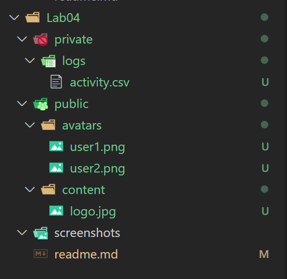

## Шаг 2. Создание бакетов

> Чем отличаются два способа управления доступом к бакетам в S3?

`ACL` - старый способ. Доступ задаётся прямо на объектах и бакете, вручную, возможно запутаться и дать лишние права. Гибко, но менее безопасно и неудобно.

`Object Ownership Enforced` - новый и рекомендуемый способ. ACL отключены, все объекты автоматически принадлежат владельцу бакета, доступ контролируется только через IAM и Bucket Policy. Проще, безопаснее, исключает путаницу с правами.

Создаю публичный бакет с такой конфигурацией:

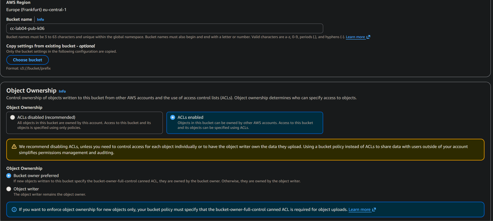

> Что означает опция “Block all public access” и зачем нужна данная настройка?

Опция “Block all public access” запрещает любому пользователю получить доступ к файлам в бакете. Нужна для защиты данных и предотвращения утечек - бакет остаётся приватным, пока сознательно не дать доступ.

Создаю приватный бакет с такой конфигурацией:

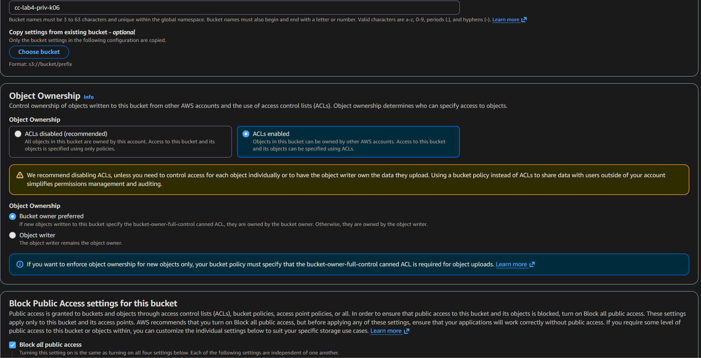

## Шаг 3. Загрузка объектов через AWS Management Console

Загружаю в публичный бакет файл user1.png со следующей конфигурацией:

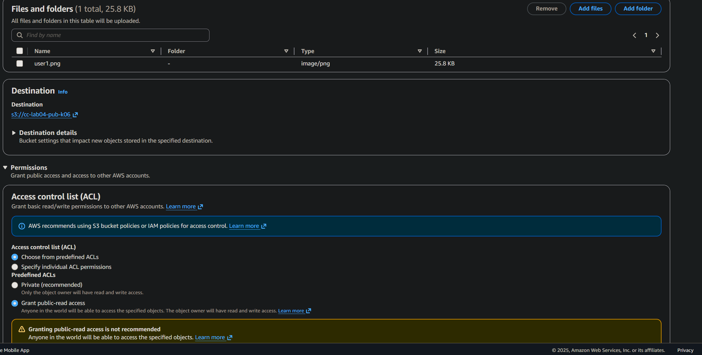

> Чем отличается ключ (object key) от имени файла?

`Object key` - это полный уникальный путь к объекту в бакете (например, images/user1.png).
`Имя файла` - только последняя часть пути (user1.png).

## Шаг 4. Загрузка объектов через AWS CLI

Загружаю `user2.jpg` через AWS CLI:

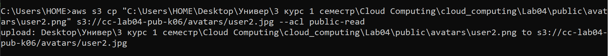

Также загружаю `logo.png`:

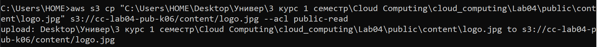

И в приватный бакет загружаю `activity.csv`

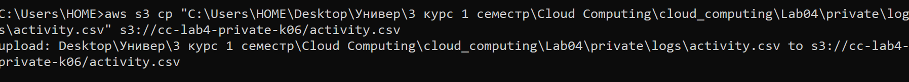

> В чём разница между командами aws s3 cp, mv и sync и для чего используется параметр флаг --acl public-read?

- `aws s3 cp` - копирует файл или папку в S3 или из S3.
- `aws s3 mv` - перемещает файл (копирует и удаляет исходный).
- `aws s3 sync` - синхронизирует локальную папку с S3 или наоборот, копируя только изменённые и новые файлы.
- `--acl public-read` делает загружаемый объект публично доступным для чтения через интернет.

## Шаг 5. Проверка доступа к объектам

Проверяю доступность аватаров в публичном бакете по ссылке https://cc-lab4-pub-kXX.s3.eu-central-1.amazonaws.com/avatars/user1.jpg и вижу загруженный аватар. Оба аватара доступны:

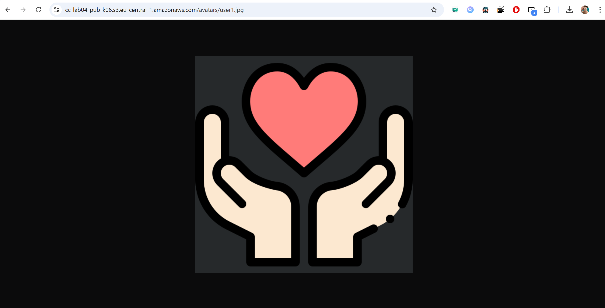

При попытке открыть файл из приватного бакета вижу ошибку:

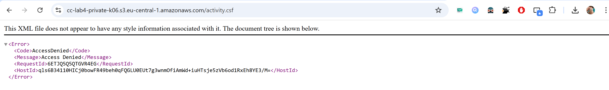

## Шаг 6. Версионирование объектов
Перехожу в Properties -> Bucket Versioning

Жму Enable для обоих бакетов.

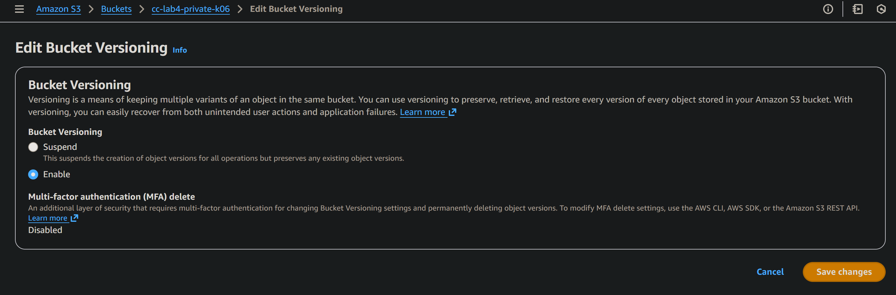

Просматриваю `Versions`:

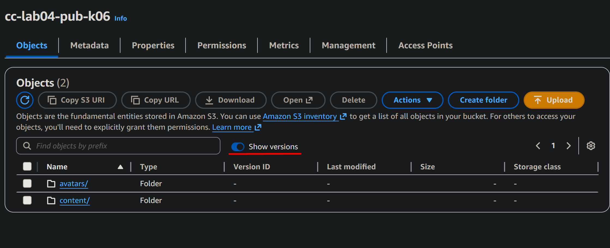

> Что произойдёт, если выключить версионирование после его включения?

Если выключить версионирование после его включения, новые версии объектов больше создаваться не будут, но уже существующие версии останутся в бакете и будут доступны

## Шаг 7. Создание Lifecycle-правил для приватного бакета

В приватном бакете захожу в Management -> Lifecycle rules -> Create lifecycle rule

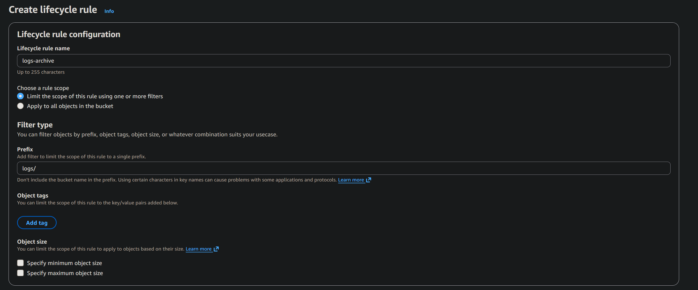

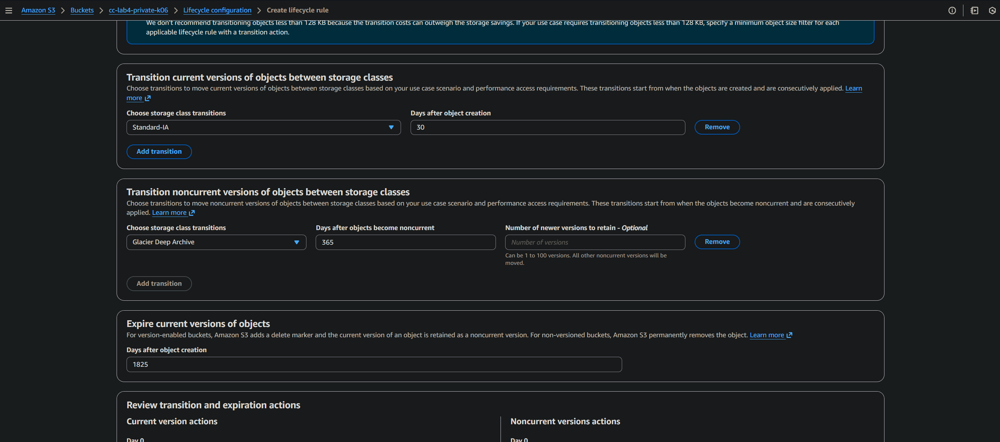

> Что такое Storage Class в Amazon S3 и зачем они нужны?

Storage Class в Amazon S3 - уровень хранения данных, определяющий скорость доступа, стоимость хранения и доступности. Они нужны, чтобы выбирать оптимальный и экономичный режим хранения для разных типов данных: часто используемые файлы - в Standard, редко используемые - в Standard-IA или Glacier, архив - в Glacier Deep Archive, чтобы платить меньше за редко доступную информацию.

## Шаг 8. Создание статического веб-сайта на базе S3

Создаю бакет `cc-lab4-web-k06`:

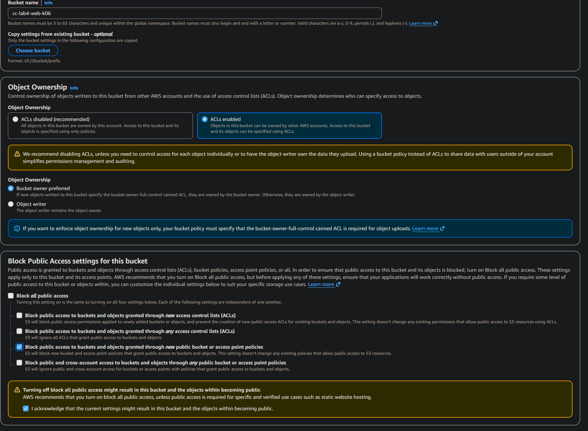