# Лабораторная работа 5
# Студент: Gachayev Dmitrii, I2302
# Дата выполнения: 19.11.2025
# Задача

# Цель

---

## Шаг 1. Подготовка среды (VPC/подсети/SG)

1. Создаю VPC через `VPC and more`:

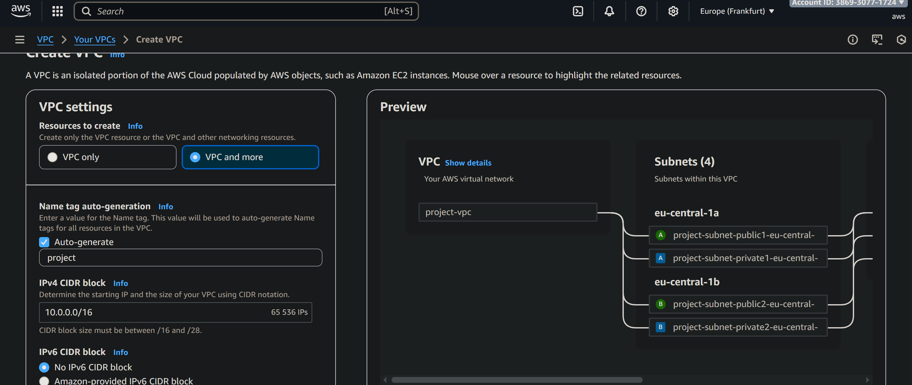

2. Перехожу в `EC2` -> `Security Groups` и создаю Security Group `web-security-group`

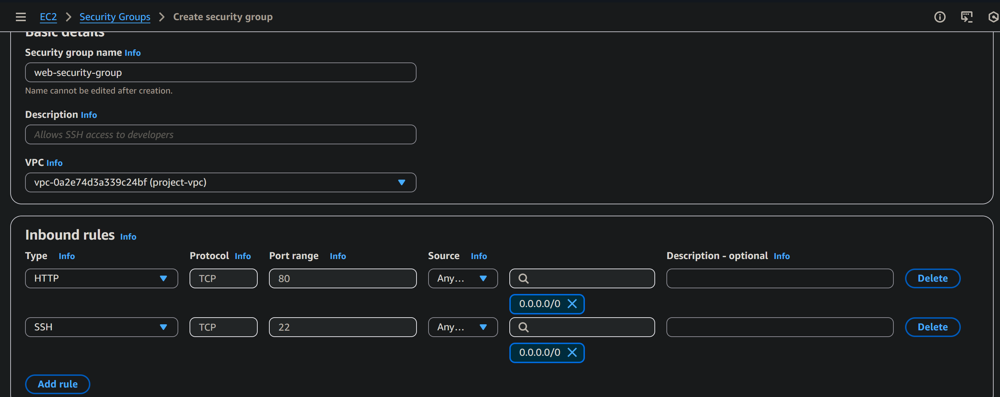

А также `db-mysql-security-group`:

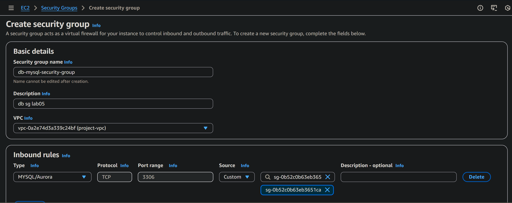

Добавляю правило в `web-security-group`:

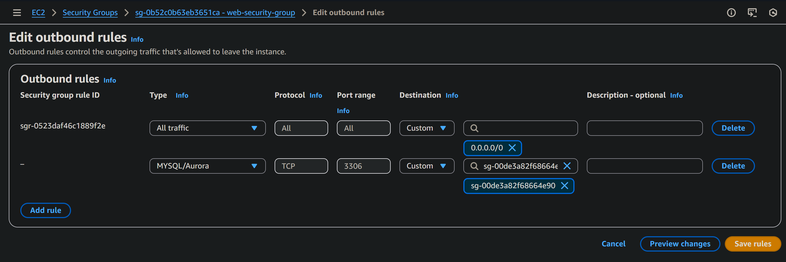

## Шаг 2. Развертывание Amazon RDS
> Что такое Subnet Group? И зачем необходимо создавать Subnet Group для базы данных?

Subnet Group - набор приватных подсетей в одной VPC, расположенных в разных Availability Zones. Это необходимо для размещения базы в приватных подсетях и обеспечения отказоустойчивости (база разворачивается в двух подсетях в разных зонах доступности).

Создаю `Subnet Group`:

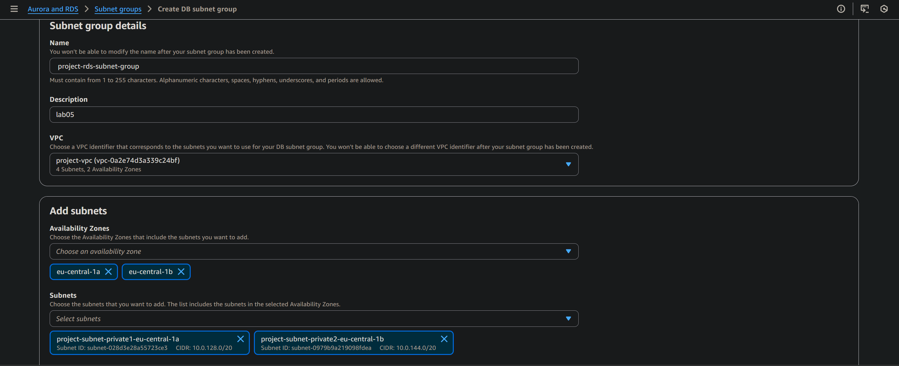
 
 Выбираю созданный ранее VPC и добавляю 2 приватные подсети из 2 разных AZ.

 Создаю экземпляр базы данных Amazon RDS со следующей конфигурацией:

- Engine type: MySQL
- Version: MySQL 8.0.42
- Templater: Free tier
- Availability and durability: Single-AZ DB instance deployment
- DB instance identifier: project-rds-mysql-prod
- Master username: admin
- DB instance class: Burstable classes (includes t classes), db.t3.micro

Storage:

- Storage type: General Purpose SSD (gp3)
- Allocated storage: 20 GB
- Enable storage autoscaling: Checked
- Maximum storage threshold: 100 GB

Connectivity:

- Don’t connect to an EC2 compute resource
- Virtual private cloud (VPC) - созданный ранее VPC
- DB subnet group: project-rds-subnet-group1
- Public access: No
- Existing VPC security groups: db-mysql-security-group
- Availability zone: No preference

Additional configuration:

- Initial database name: project_db
- Backup (Enable automated backup): Checked
- Backup (Enable encryption): Unchecked
- Maintanance (Enable auto minor version upgrade): Unchecked

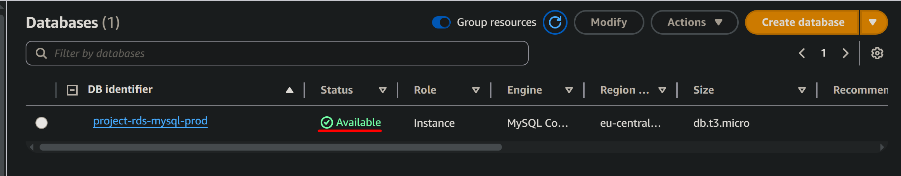

## Шаг 3. Создание виртуальной машины для подключения к базе данных

Создаю инстанс EC2 в публичной подсети VPC, группа безопасности `web-security-group`, при инициализации устанавливаю MySQL клиент, чтобы упростить подключение к базе данных RDS:
```
#!/bin/bash
dnf update -y
dnf install -y mariadb105
```

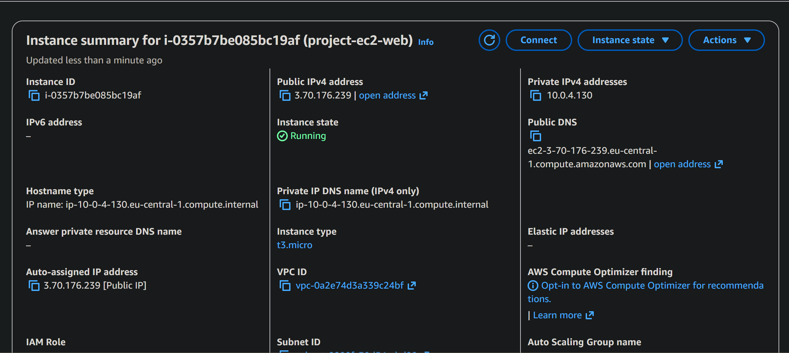

## Шаг 4. Подключение к базе данных и выполнение базовых операций

1. Подключаюсь к инстансу EC2:
```
ssh -i key.pem ec2-user@3.70.176.239
```

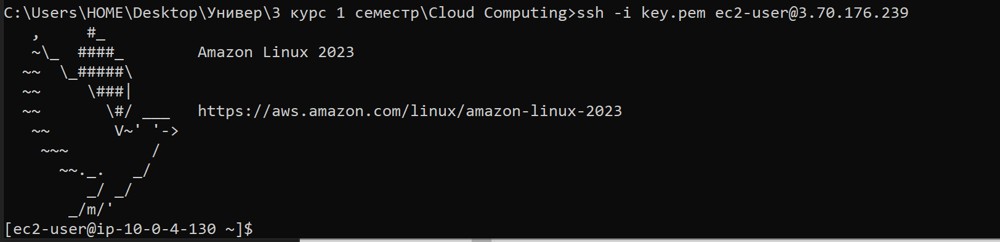

2. Подключаюсь к базе данных RDS с помощью MySQL клиента:
```
bash mysql -h project-rds-mysql-prod.czy2ggkisad2.eu-central-1.rds.amazonaws.com -u admin -p
```

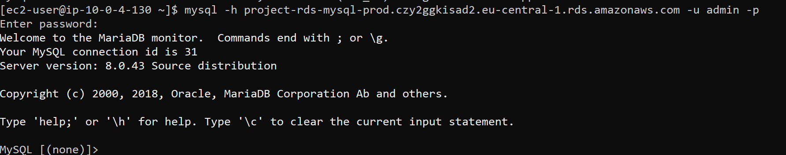

Создаю таблицу:

```sql
CREATE TABLE categories (
    id INT AUTO_INCREMENT PRIMARY KEY,
    name VARCHAR(50) NOT NULL
);

CREATE TABLE todos (
    id INT AUTO_INCREMENT PRIMARY KEY,
    title VARCHAR(100) NOT NULL,
    category_id INT NOT NULL,
    status VARCHAR(20) NOT NULL,
    FOREIGN KEY (category_id) REFERENCES categories(id)
);
```


Вношу в базу тестовые данные:
```sql
INSERT INTO categories (name) VALUES
('Work'),
('Study'),
('Home');

INSERT INTO todos (title, category_id, status) VALUES
('Finish AWS lab', 2, 'in_progress'),
('Clean the room', 3, 'todo'),
('Prepare presentation', 1, 'done'),
('Watch lecture', 2, 'todo'),
('Pay bills', 3, 'done');
```

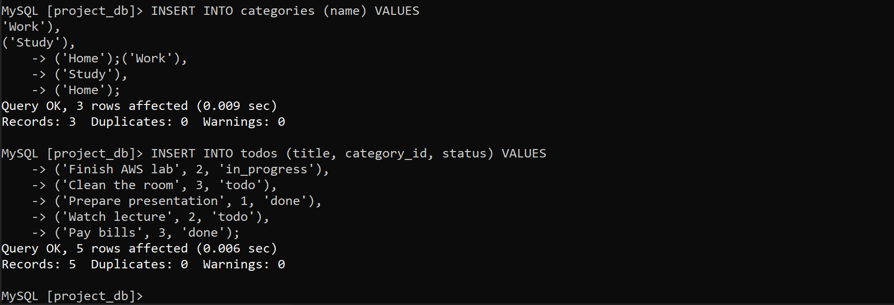

Выполняю несколько запросов на выборку данных:
```sql
SELECT * FROM categories;

SELECT * FROM todos;

SELECT 
    todos.id,
    todos.title,
    todos.status,
    categories.name AS category
FROM todos
JOIN categories ON todos.category_id = categories.id;

SELECT t.title, t.status
FROM todos t
JOIN categories c ON t.category_id = c.id
WHERE c.name = 'Study';
```
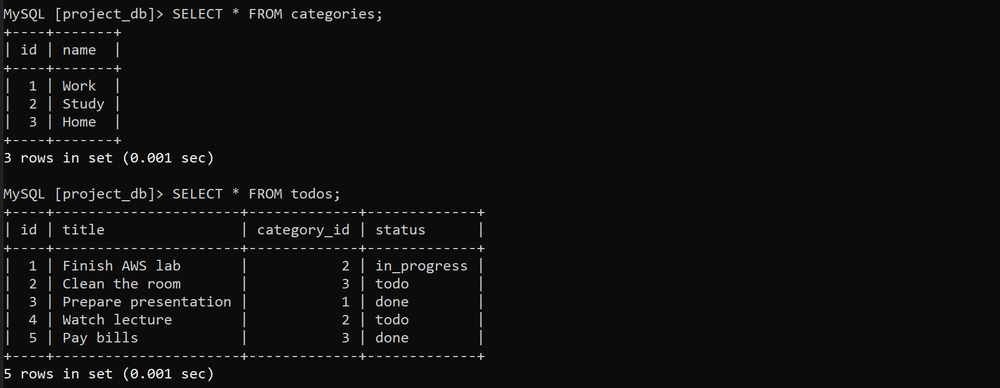

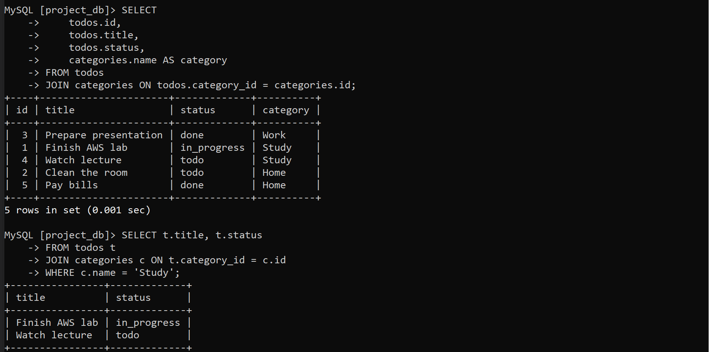

## Шаг 5. Создание Read Replica
Перехожу в `Databases` -> `Actions` -> `Create read replica`

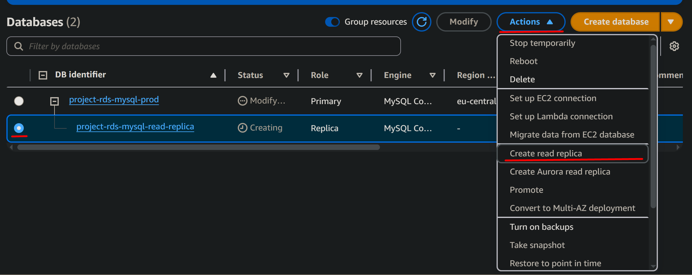

Создаю реплику со следующей конфигурацией:

- DB instance identifier: project-rds-mysql-read-replica
- Instance class: db.t3.micro
- Storage type: General Purpose SSD (gp3)
- Enable Enhanced monitoring: Unchecked
- Public access: No
- VPC security groups: db-mysql-security-group

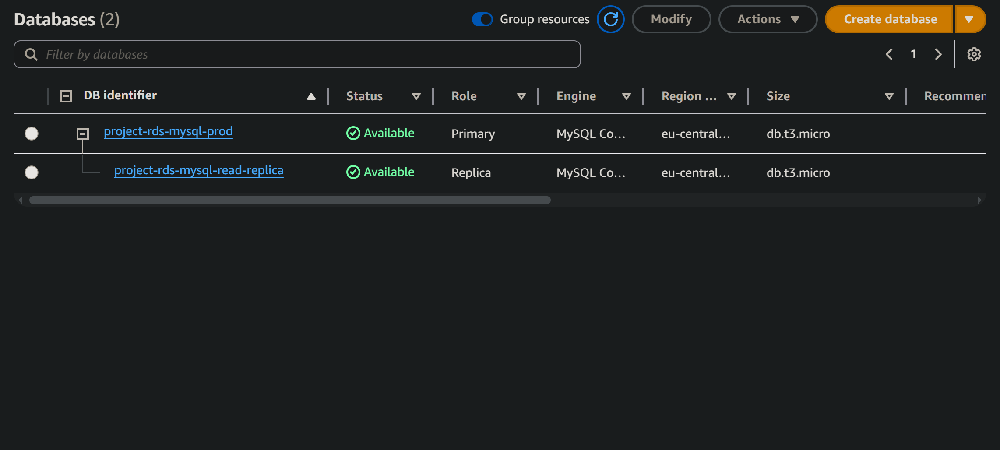

Подключаюсь к реплике и выполняю несколько запросов:


> Какие данные вы видите? Объясните почему.

Реплика получает копию данных от primary через механизм репликации, соотвественно данные те же что в основной бд.

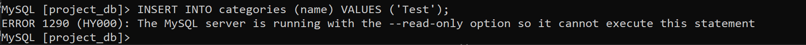

> Получилось ли выполнить запись на Read Replica? Почему?

Реплика только read-only, вставлять данные нельзя, только читать.

Перехожу на основную бд, вставляю следующую строку:

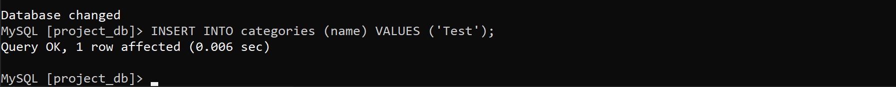

Возвращаюсь к реплике и проверяю отобразилась ли новая запись:

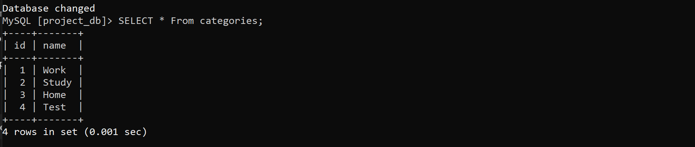

> Отобразилась ли новая запись на реплике? Объясните почему.

Новая запись появилась, так как реплика периодически копирует изменения с primary, поэтому новые данные появляются автоматически.

> Объясните, зачем нужны Read Replicas и в каких сценариях их использование будет полезным.

Read Replicas нужны для разгрузки основной базы данных и масштабирования чтения.
Они полезны, когда много запросов SELECT, при аналитике, отчётах, дашбордах, поиске и любых операциях, где нужна высокая скорость чтения без нагрузки на primary.

## Шаг 6. Подключение приложения к базе данных