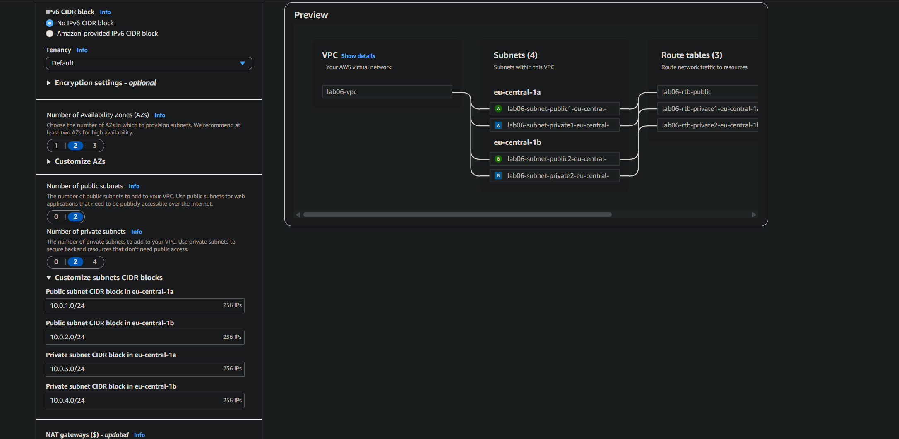
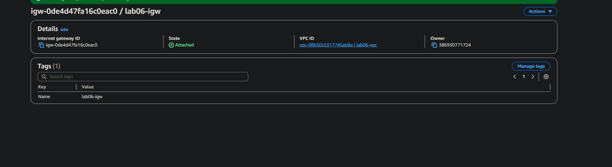
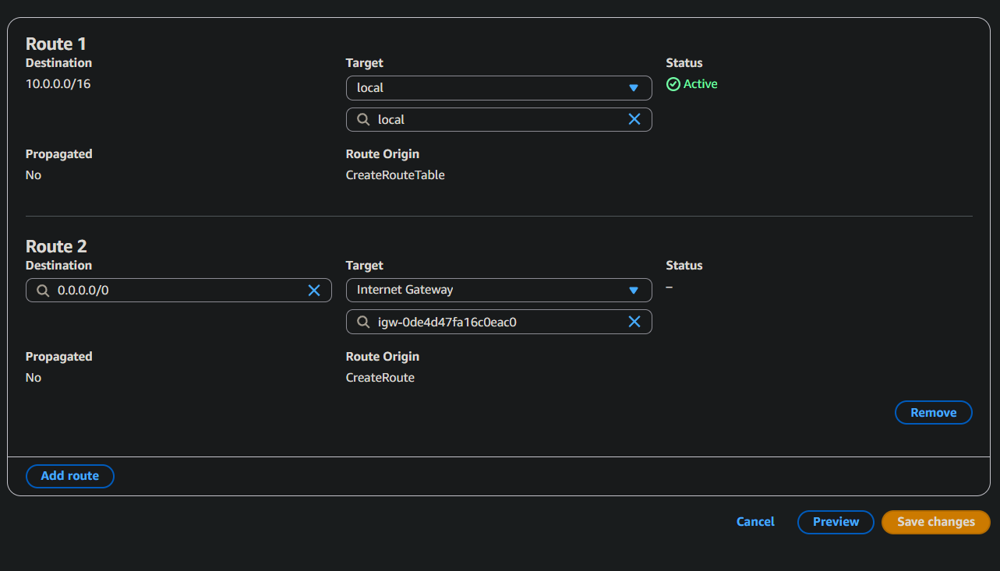
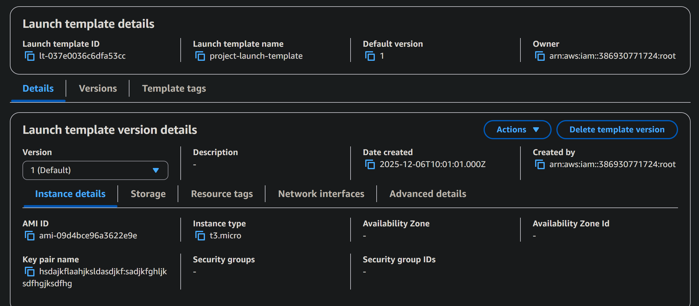
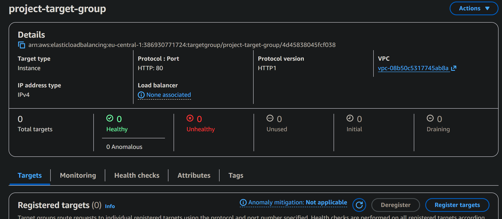
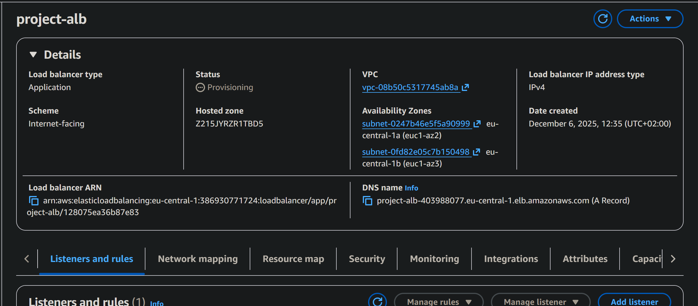
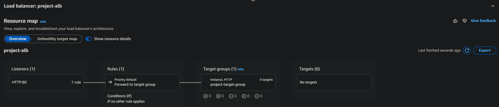
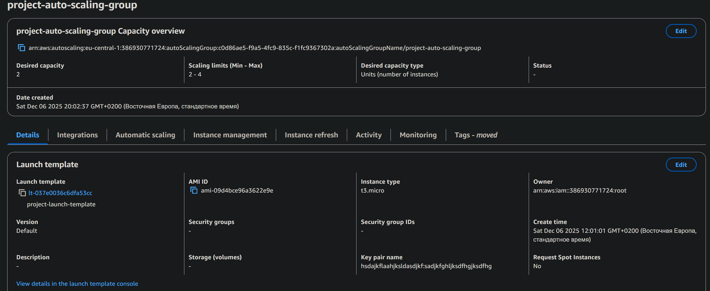
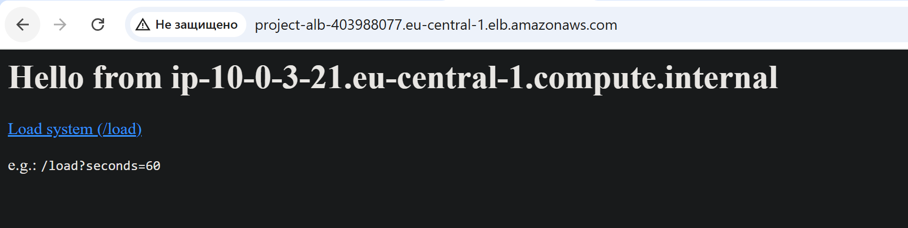
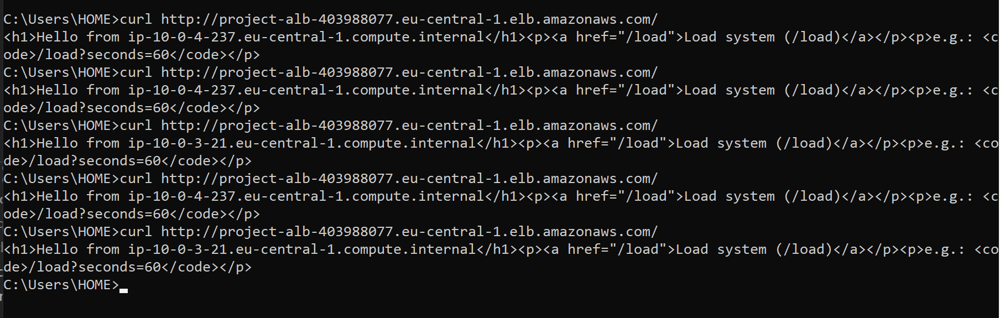

# Лабораторная работа 6
# Студент: Gachayev Dmitrii, I2302
# Дата выполнения: 05.12.2025
# Задача
///
# Цель
Закрепить навыки работы с AWS EC2, Elastic Load Balancer, Auto Scaling и CloudWatch, создав отказоустойчивую и автоматически масштабируемую архитектуру.

---

## Шаг 1. Создание VPC и подсетей

Создаю VPC со следющей конфигурацией: 

Привязываю IGW к созданной VPC:

Создаю Internet Getaway, добавляю Route:

## Шаг 2. Создание и настройка виртуальной машины
Создаю EC2 инстанс со следующей конфигурацией:
- Запускаю машину в созданной подсети
- AMI: Amazon Linux 2
- Тип: t3.micro
- Enable auto-assign public IP
- SSH (порт 22) — my IP
- HTTP (порт 80) — источник: 0.0.0.0/0
- Все трафики — источник: 0.0.0.0/0
- Detailed CloudWatch monitoring
- В UserData вставляю приложенный `init.sh`

В итоге перехожу на публичный IP и вижу ожидаемый вывод из `init.sh`:

## Шаг 3. Создание AMI 

Перехожу в Instance → Actions → Image and templates → Create image и создаю AMI:

> Что такое image и чем он отличается от snapshot? Какие есть варианты использования AMI?

AMI - это образ, включающий операционную систему и приложения для создания EC2 экземпляров. Snapshot -  снимок состояния тома EBS для резервного копирования или восстановления данных. Основное отличие: - AMI используется для создания экземпляров, Snapshot - для восстановления томов

## Шаг 4. Создание Launch Template
Создаю Launch Template со следующими параметрами:

- Название: project-launch-template
- AMI: созданная ранее AMI
- Тип инстанса: t3.micro
- Security groups: та же группу безопасности, что и для виртуальной машины.
- В разделе Advanced details -> Detailed CloudWatch

> Что такое Launch Template и зачем он нужен? Чем он отличается от Launch Configuration?

- Launch Template - более гибкий инструмент для настройки EC2, поддерживает версии и изменения после создания 
- Launch Configuration - устаревший, только для Auto Scaling и без возможности редактирования после создания

## Шаг 5. Создание Target Group
Создаю Target Group со следующими параметрами:
- Название: project-target-group
- Тип: Instances
- Протокол: HTTP
- Порт: 80
- VPC: созданная раннее VPC

> Зачем необходим и какую роль выполняет Target Group?

Target Group в AWS EC2 группирует экземпляры для маршрутизации трафика от балансировщика нагрузки. Он обеспечивает отказоустойчивость, направляя трафик только к здоровым экземплярам.

## Шаг 6. Создание Application Load Balancer

Создаю Load Balancer со следующей конфигурацией:

- Название: project-alb
- Scheme: Internet-facing
- Subnets: 2 публичные подсети.
- Security Groups: та же, что и для виртуальной машины
- Listener: протокол HTTP, порт 80.
- Default action: project-target-group.

> В чем разница между Internet-facing и Internal?

- Internet-facing  балансировщик нагрузки, доступный из интернета, направляет трафик на целевые группы. 
- Internal - доступен только внутри VPC, для маршрутизации трафика между ресурсами внутри сети.

> Что такое Default action и какие есть типы Default action?

Default action - действие по умолчанию, если запрос не соответствует правилам маршрутизации. 

Типы:

- Forward - направляет на Target Group
- Fixed response - возвращает фиксированный ответ
- Redirect - перенаправляет на другой URL

## Шаг 7. Создание Auto Scaling Group
Создаю Auto Scaling Group со следующей конфигурацией:
- Название: project-auto-scaling-group
- Launch template: project-launch-template
- Network: созданная VPC и две приватные подсети.
- Availability Zone distribution: Balanced best effort.
- Attach to an existing load balancer - project-target-group
- Минимальное количество инстансов: 2
- Максимальное количество инстансов: 4
- Желаемое количество инстансов: 2
- Average CPU utilization - 50% / Instance warm-up period - 60 seconds
- Enable group metrics collection within CloudWatch

> Почему для Auto Scaling Group выбираются приватные подсети?

Выбираются для повышения безопасности, так как экземпляры не имеют прямого доступа к интернету, что уменьшает риски атак. Также, это часто нужно для приложений, работающих в закрытых инфраструктурах

> Зачем нужна настройка: Availability Zone distribution?

Настройка помогает распределить инстансы между несколькими зонами доступности для повышения отказоустойчивости и минимизации воздействия сбоев в одной зоне

> Что такое Instance warm-up period и зачем он нужен?

Это время, которое AWS ждет после запуска нового экземпляра, прежде чем начать считать его готовым к обработке трафика. Нужно, чтобы дать инстансу время на запуск и настройку, избегая перегрузки системы при быстрых изменениях нагрузки

## Шаг 8. Тестирование Application Load Balancer
Ввожу DNS имя в браузер и вижу страницу:

При обновлении IP адреса не меняются, но если проверить через `curl` можно заметить динамику:

> Какие IP-адреса вы видите и почему?

Я вижу внутренние приватные IP-адреса вида 10.0.x.x. Это адреса EC2-инстансов внутри Auto Scaling Group, на которые балансировщик распределяет трафик

## Шаг 9. Тестирование Auto Scaling