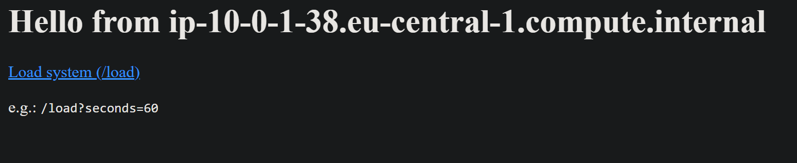
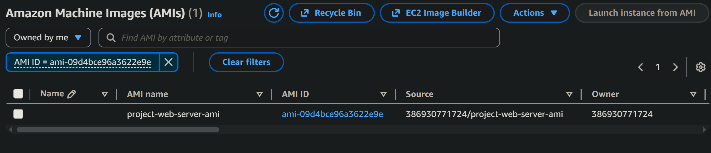

## Шаг 2. Создание и настройка виртуальной машины
Создаю EC2 инстанс со следующей конфигурацией:
- Запускаю машину в созданной подсети
- AMI: Amazon Linux 2
- Тип: t3.micro
- Enable auto-assign public IP
- SSH (порт 22) — my IP
- HTTP (порт 80) — источник: 0.0.0.0/0
- Все трафики — источник: 0.0.0.0/0
- Detailed CloudWatch monitoring
- В UserData вставляю приложенный `init.sh`

В итоге перехожу на публичный IP и вижу ожидаемый вывод из `init.sh`:

## Шаг 3. Создание AMI 

Перехожу в Instance → Actions → Image and templates → Create image и создаю AMI:

> Что такое image и чем он отличается от snapshot? Какие есть варианты использования AMI?

AMI - это образ, включающий операционную систему и приложения для создания EC2 экземпляров. Snapshot -  снимок состояния тома EBS для резервного копирования или восстановления данных. Основное отличие: - AMI используется для создания экземпляров, Snapshot - для восстановления томов

## Шаг 4. Создание Launch Template